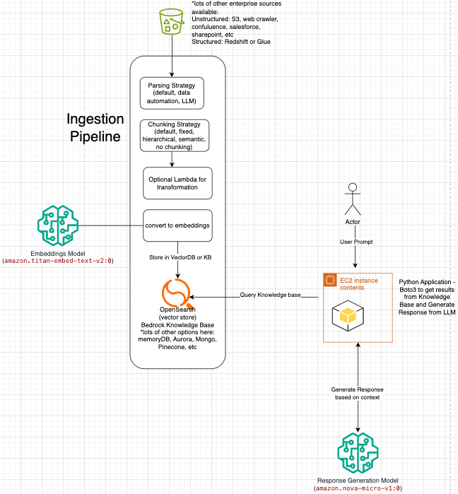

# Solution Overview

# Setup
    conda create --name bedrock-rag-venv python=3.11
    conda activate bedrock-rag-venv
    pip install -r requirements.txt

    # Connect to AWS SSO
    export AWS_PROFILE=altaprise.aws
    aws sso login
    
    python create_knowledge_bae.py